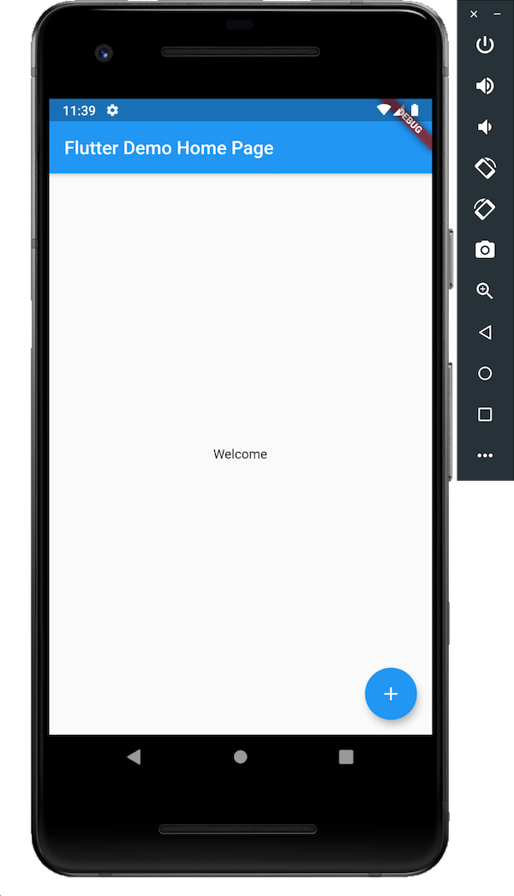
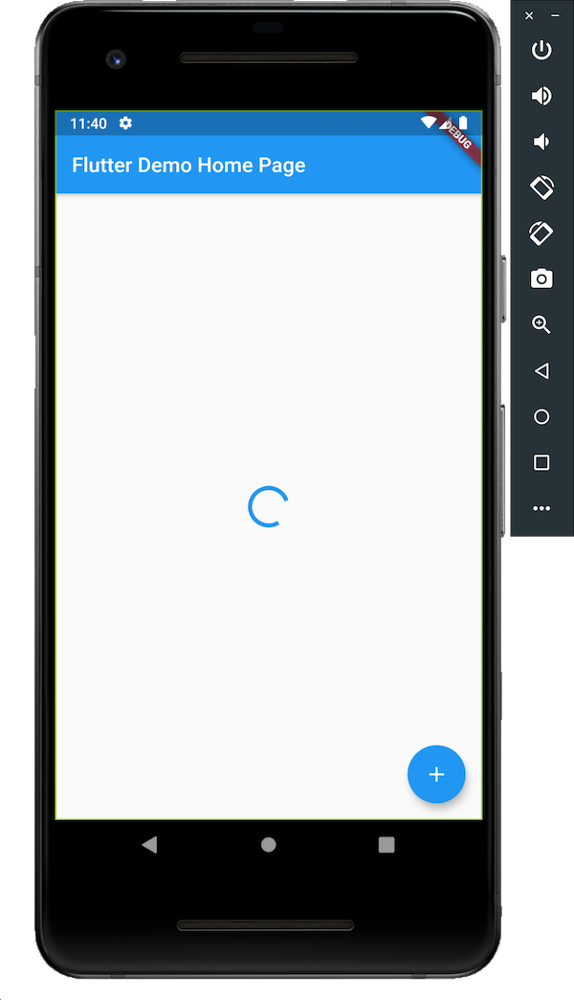

# Network Request Challenge

Write an app which displays a 'Welcome' status message and a floating action button. 
When the app is loaded it begins making an HTTP request to this URL: http://slowwly.robertomurray.co.uk/delay/8000/url/http://www.google.co.uk

When the user presses the floating action button, it does the following: 
- While the pending HTTP request is not complete, it displays a spinner instead of status text and makes the button disabled. 
- Then when the HTTP is completed it displays the status code of the request.

Note that **the HTTP request begins when the app is loaded, not when the user presses the button**. Also the app will NOT display the status code unless the user presses the button. Also if the HTTP request has completed when the user presses the button it will immediately display the status code.

### Screenshots:

