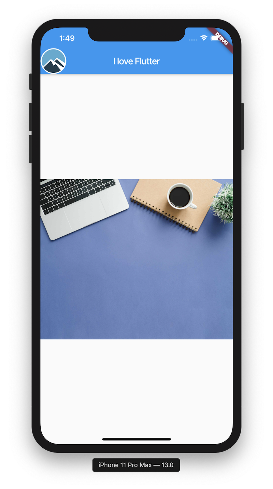

 1. Create a layout to look like this:

      

[Starter Repository](https://github.com/McLarenCollege/Day-1-Scaffold-assignment)

 2. **Stretch** - Add floating action button with an icon

 

 3. [Dart chain Link Exercise](https://github.com/McLarenCollege/dart_chain_link)

 4. [Fibonnaci Series](https://github.com/McLarenCollege/fibonnaci_day_1_assignment)