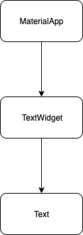
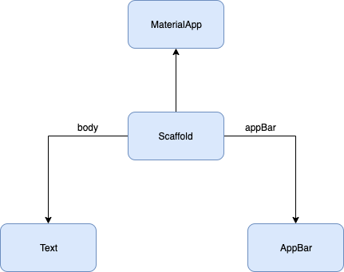
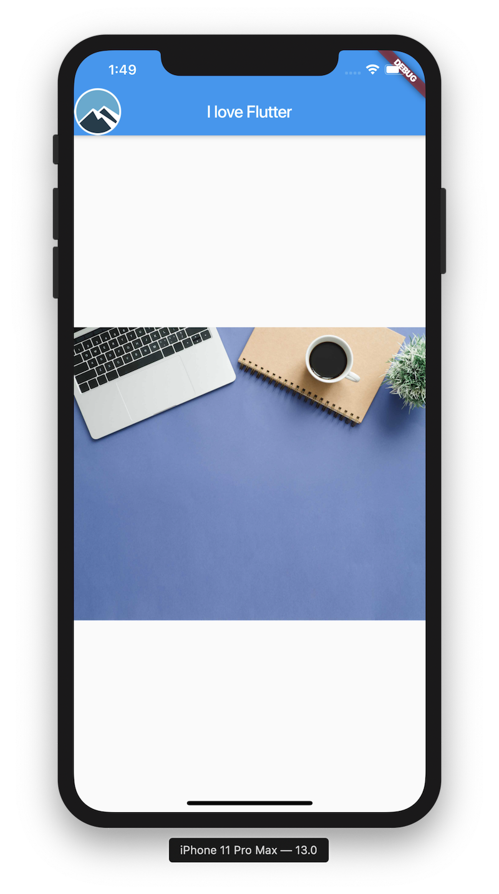
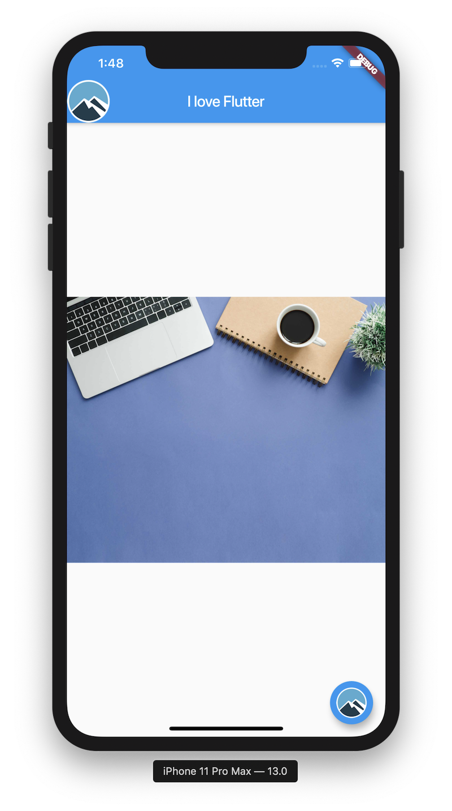

# Welcome to Flutter Course
### You will find day wise notes of the course here

## Structure of the notes
- Content on the topics covered
- Link to Classroom exercises
- Assignments for the day

# Day 1 - Layouts in Flutter


## How to fix errors?

 1. Read and try to understand error messages
 2. Compare syntax with sample code known to work
 3. Comment out code until it compiles, then slowly add code until you encounter an error
 4. Google it, then try to understand the stack overflow answer. Read the best answer, read the official documenation for method calls, etc.
 5. Print debugging (or with proper IDE debugger)
 6. Try different way to write the same logic (Ex sorting in reverse order)

## Optional and Named Parameters in Dart
```dart
void main() {
  fullName('Arnav', 'Puri');
  calculateTotalBill(200, tip: 50); // 250
  calculateTotalBill(150); // 150
}
// function with middleName as optional parameter
  void fullName(String firstName, String lastName, [String middleName]) {
      print('$firstName $middleName $lastName');
  }
  // function with tip as optional and named parameter, it also has a default value of 0
  double calculateTotalBill(double billTotal, {double tip = 0}){
    return billTotal + tip;
  }
```

## Running Flutter App

[Starter Code](https://github.com/McLarenCollege/day1_scaffolding)

### Current Widget Tree


**How can we center the Text on Screen?**
We can use a `Center` widget

The code would look like this
```dart
    void main(){
      String msg = 'Hello World';
      Text textWidget = Text(msg);
      Center center = Center(textWidget);
      MaterialApp myApp = MaterialApp(home: center);  
      runApp(myApp);
    }
```
But more common way of writing this is in one line, so the code would look like this:
```dart
    void main() => MaterialApp(home: Center(Text('Hello World'),),);
```

Better formatted with `dartfmt`.

### Scaffolding an App
Scaffolding means a structure. Flutter has a library called `material` which we import in almost all Flutter related code. It provide a nice way to create an app which has an `AppBar` and `Body` and several other features

Whenever you start learning something new, always remember to checkout documentation of that topic, in this case [Scaffolding](https://api.flutter.dev/flutter/material/Scaffold-class.html)  it is super helpful.

[Mid Day Repo](https://github.com/McLarenCollege/day1_mid_start)

Scaffold consist of two major components, appBar and body,




### Exercises for the day:
 1. Create a layout to look like this:
 
      
      
 2. Stretch - Add floating action button with an icon
 
 
 
 3. [Dart chain Link Exercise](https://github.com/McLarenCollege/dart_chain_link) 