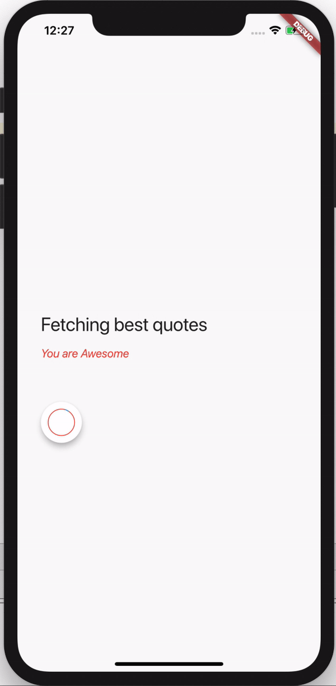

# Day 13 - Refactoring And Loading Screen

# Assignments for the day

1. Morning Challenge [Starter code](https://github.com/McLarenCollege/day_13_morning_challenge)
2. Weather App Part 2
    - Get weather for a particular city now   
    - Add Text field and make it searchable for any location
    - Add new method to NetworkHelper class to fetch weather of a city
    - Add try/catch again in loading screen to show the alert if location permission is not available
    
    
    
3. Kismet App Improvements (if not done yesterday)
    - As of now we are using if/else blocks to navigate the stories. Imagine having longer stories, it would mean more if/else block.
    Basically not a scalable way of creating app.
    - Use the [JSON data](https://gist.githubusercontent.com/McLarenCollege/45f2c0107d9436b2f64a588cbd243a6a/raw/09fb409998a24a5dfdf0f7b378e58284c9e3423e/kismet_story.json) to modify the `story` class 
    - Refactor storyBrain 
    
4. Quotes Application (if not done yesterday)
    - Build Quotes app from Scratch [Starter Repository](https://github.com/McLarenCollege/quotes_app_starter)
    - The starter repo contains bare minimum layout
    - Make a network request to `https://favqs.com/api/qotd`
    - design the layout and display the quotes
    
    
    
5. Quotes Application (if done yesterday)
    - Add animation while user is waiting
    
    
 
6. **Stretch** Movies List
    - 