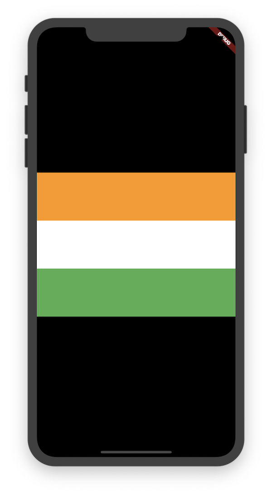
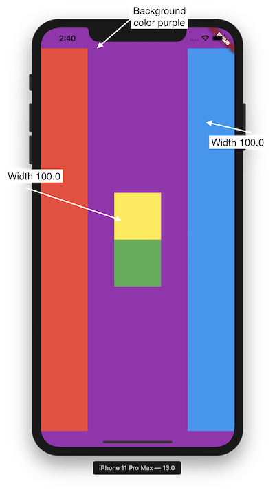

# Day 2 - Layouts in Flutter

## Layouts in Flutter

 
 
 - [starting repo](https://github.com/McLarenCollege/day2_starter_code)
 
 - [Container Widget](https://api.flutter.dev/flutter/widgets/Container-class.html)
    - It is used in a lot of places
    - Takes up all space available on screen (or of parent) 
    - Single child widget which means it can contain only one more widget
    - If there is a child in `container` it resizes to the child's size
 - [Safe Area](https://api.flutter.dev/flutter/widgets/SafeArea-class.html)
    - Takes care of status bar and put content in main screen
 
 - Container properties
    - Width
    - Height
    - Margin - `EdgeInsets.all`,`EdgeInsets.symmetric`
    - Padding
  
  - List of specific types
        - By default List can contain dynamic objects
        - We can specify the type of List by declaring it like this List<T>
        - Example, List<String> names = ['Arnav', 'Mark', 'Raj' ]
  
  ### Multi child widgets - Rows & Columns
  [Widget types](https://flutter.dev/docs/development/ui/widgets/layout)
  - Most of the layouts have nested elements and Rows & Columns allow us to create such layouts
   
[catchup gist](https://gist.githubusercontent.com/ArnavPuri/c590759a6eec89a30716b7745a7b0a4d/raw/fc6c629c4d53f3bff3af305eeed0d59c4f08eff2/day%25201%2520catchup%2520containers%2520list.dart)

- `MainAxisSize` min and stretch
- `MainAxisAlignment` to show center, start, end and spaceEvenly

- crossAxisAlignment 
    - make width of all 100
    - make width of one 300 and then explain what's happening
- use crossAxisAlignment.stretch and get rid of width property on containers

[Layout cheat sheet](https://medium.com/flutter-community/flutter-layout-cheat-sheet-5363348d037e
)

## Exercises for the day:

 1. Design the layout given below 
 
 
 

 2. [NewYork Times Layout without font styles](https://github.com/McLarenCollege/day_2_nytimes_assignment)
 
 

 