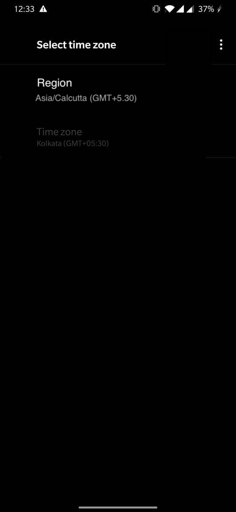

# Assignments for the day

1. Morning Challenge
2. **Stretch** Timezone picker 
    - Stage 1
    - Create a screen which displays timezone property similar to:
     
     
     
     But we want to merge the region and timezone property
     so it should be: Asia/Kolkata (GMT+5.30)
     
     When this item is clicked it should take me to list of all available timezones
     
     
        
     - Stage 2
     Implement search on list page just like flutter sample app
     
     
