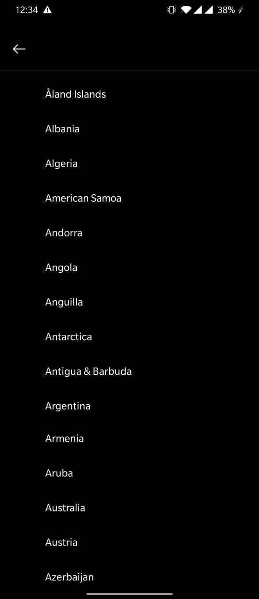

# Day 26 - Assignments for the day

1. Morning Challenge
2. Refactor [Ashish's code](https://github.com/AshishTaduce/day_25_morning_challenge)
3. Refactor your own Sudoku Code
4. Timezone picker

    **Stage 1**:
    Create a screen which displays timezone property similar to:
 
 
 But we want to merge the region and timezone property
     so it should be: India/Kolkata (GMT+5.30)/1.00 PM
     
 When this item is clicked it should take me to list of all available timezones
 
 

**Stage 2**: Implement search on list page just like flutter sample app
     
