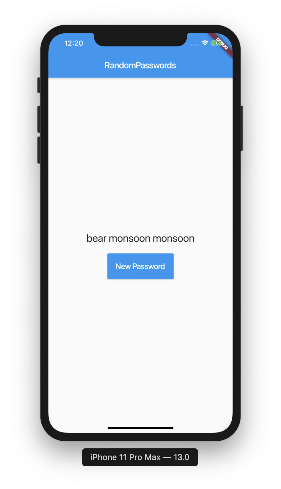
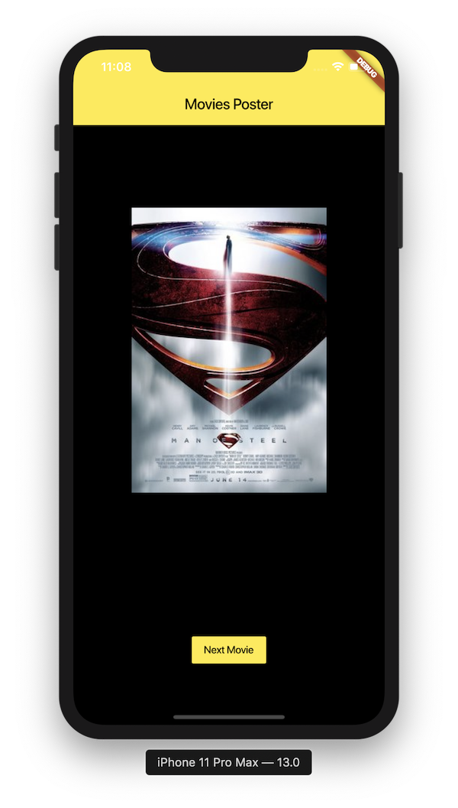

# Day 4 - Roll the Dice

## Exercises
1. Create password generator app using provided list of 50 words
[Starter Repo](https://github.com/McLarenCollege/day_4_random_word_assignment)
    
    
    
    
    
    - **Stretch** 
        1. Use [this package](https://pub.dev/packages/english_words) to get random words
        2. Make the output camel case 

2. Movies app assignment - [Starter Repo](https://github.com/McLarenCollege/day_4_movies_assignment)
    
    

3. **stretch** Translate App design

 
