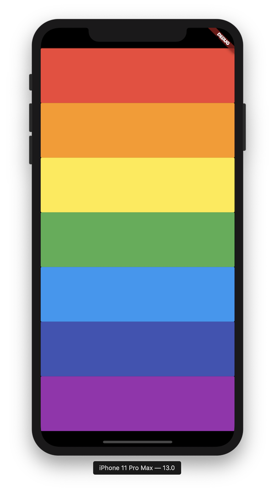

# Day 5 - Play the music!

## Challenge for the day (8.30 AM)

[Day 5 Morning Challenge](https://github.com/McLarenCollege/Day-5-Morning-Challenge)

## Topics covered:
- Packages in Flutter
- Documentation and implmentation of packages

## Assignments to be submitted today
1. Morning Challenge
2. Xylophone app

3. In Password generator app created yesterday
   - Use [this package](https://pub.dev/packages/english_words) to get random words
   - Make the output camel case  (HINT: Google) 

4.  Layout for the next day's project `QuizApp`
[Starter Repo](https://github.com/McLarenCollege/quiz_app)

 

5. Use this [Carousel package](https://pub.dev/packages/carousel_slider) to show all posters in caraousel.

6. Music Player App [Starter Repo](https://github.com/McLarenCollege/spotify_player_clone)
    - Layout like Spotify 
    
    
    
    - You are given a song, play and pause should work
    
    - Class of Song (url, title, singer) with list of albums
    
    - **stretch** Implement Next and Prev using list of albums  

