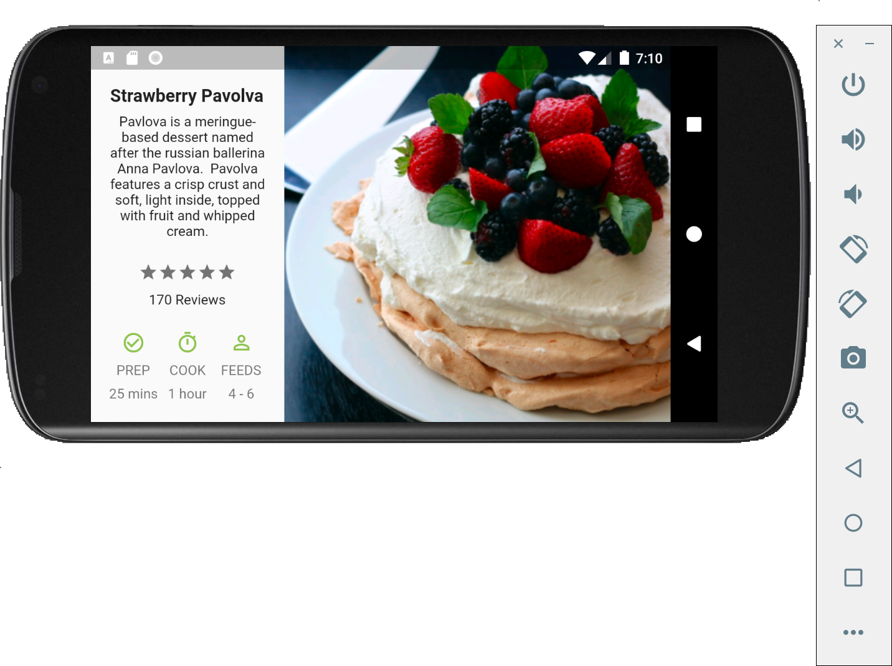
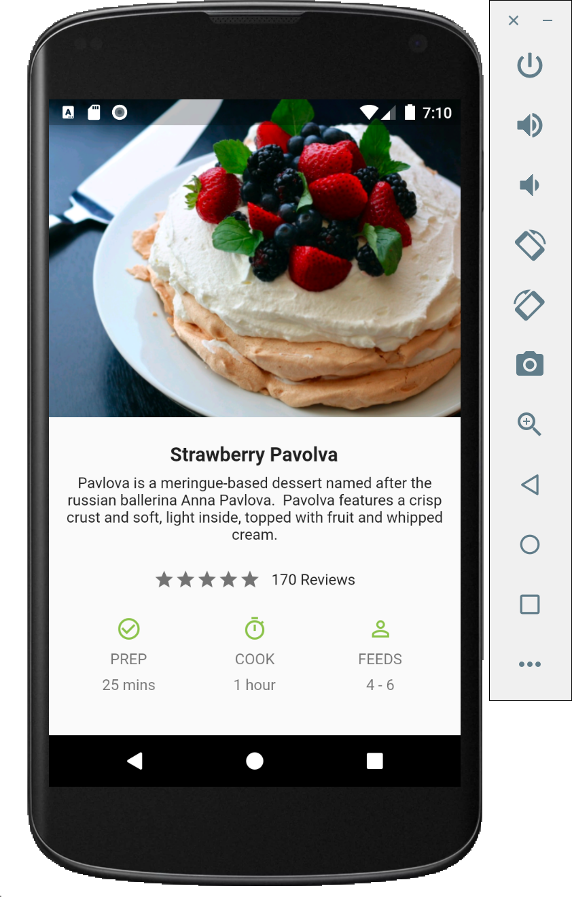
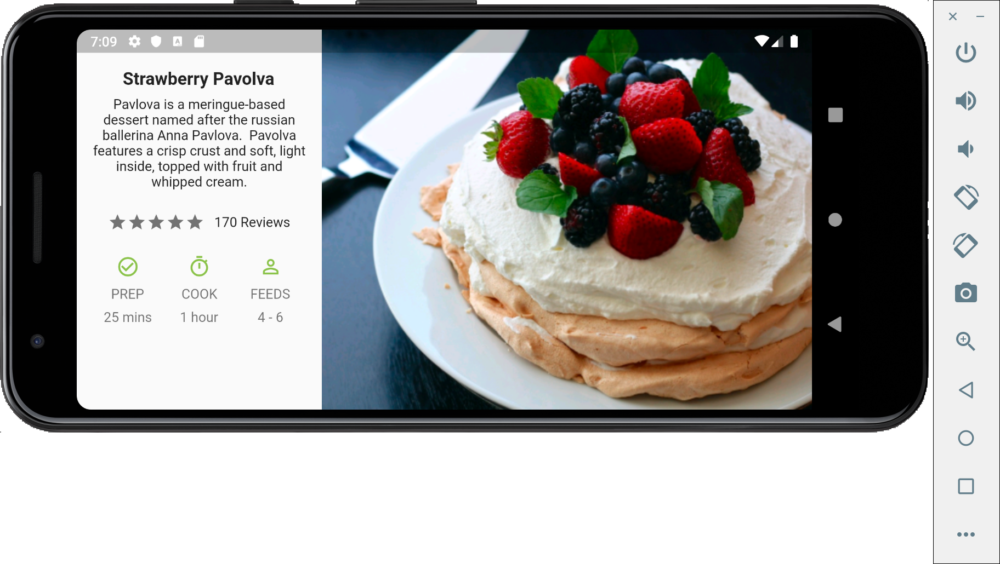
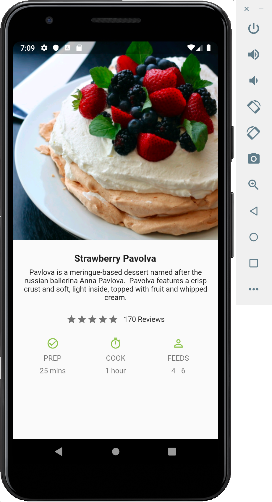

# Day 6 

## Morning Challenge
[Morning Challenge](https://github.com/McLarenCollege/morning_challenge_day_6)

## Assignments for the Day

**Before attempting these please submit all previous days' exercises**

- Spotify next and previous implementation
- **Stretch** Fit and finish of Recipe app
    - Different Orientations
    - Different Screen Sizes
    - Sizedbox
    - Remove unnecessary widgets
    
You should use Nexus 4 Android device
    

