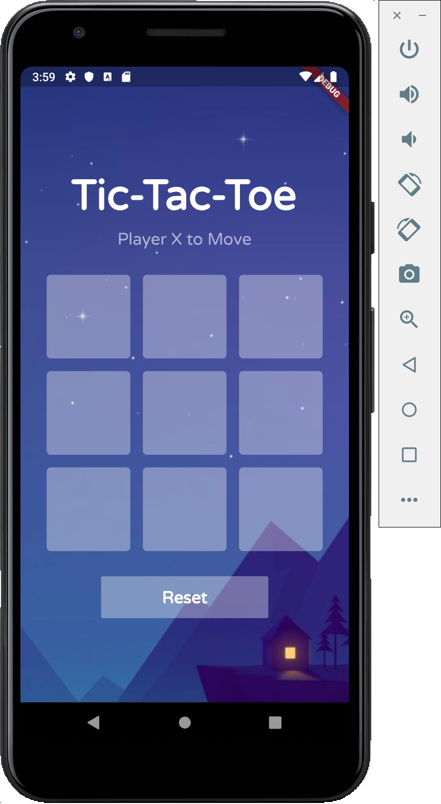

# Day 8 - BMI Part 1

## In Class App
Today we will be building a BMI (Body Mass Index) app inspired by UI [design on dribble](https://dribbble.com/shots/4585382-Simple-BMI-Calculator/attachments/1036693)

Steps 
1. 

2. 

## Exercises for the day

1. Morning challenge
2. Write a test case for testing winning (diagonally and row)
3. TicTacToe Layout [Starter Repo will be provided]()

4. 
