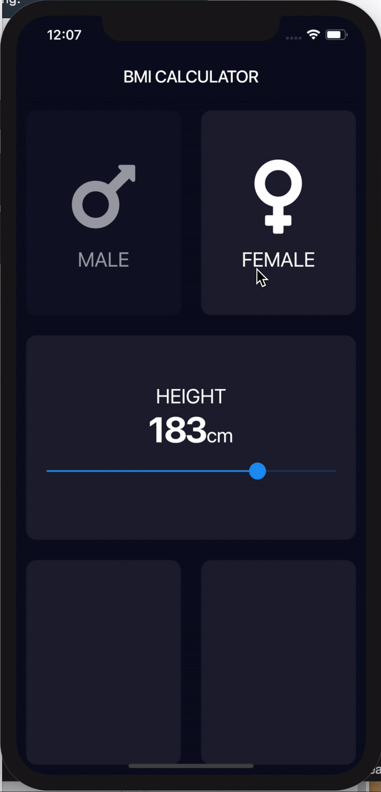
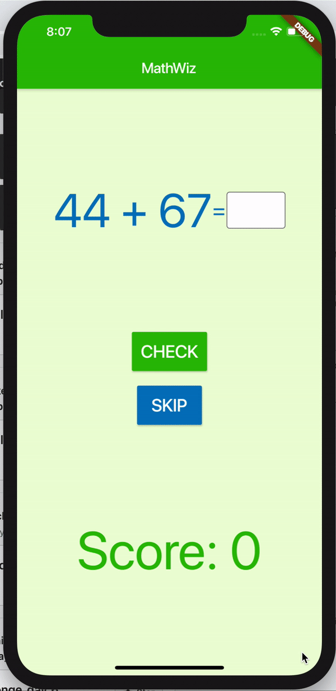

# Day 9 - BMI Part 2

## In Class App
We stopped at this point so please make sure to check in your code with this layout

## Make sure you have submitted all the exercises from yesterday before you attempt today's challenges

## Assignments for the Day
1. Morning Challenge
2. BMI App with text styles and functional slider (Have a look at documentation)

3. **Stretch** BMI App with pink thumbnail

4. TicTacToe app add 'X' and 'O' when tapped, Use 'close' icon from Flutter Icons and 'circle' icon from FontAwesome package
(Overriding is allowed) (Reset button not functional is fine)

5. **Stretch** MathWiz App 
[Starter Repository](https://github.com/McLarenCollege/math_wizard_starter)

Layout: 

Demo: Layout: 