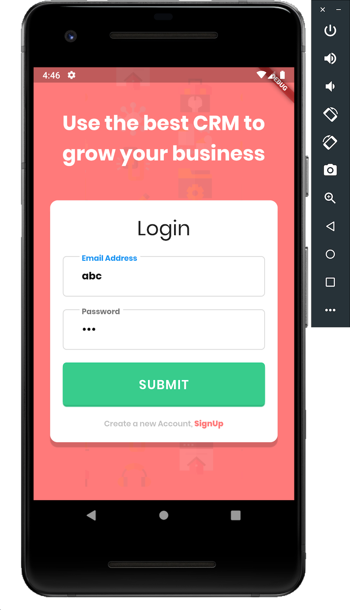
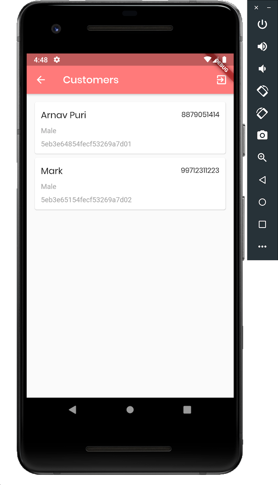

# Build Flutter app using ExpressJS endpoints
## Requirements
- Login using ExpressJS
- Show all customers for the logged in user
- Add refresh button to update customers list
- Logout

## Screenshots

