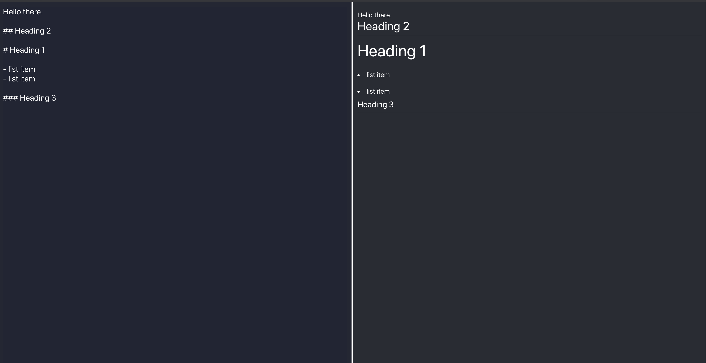

# React Markdown Editor

Use Regular Expressions to create a live markdown editor. 
It should be able to:
- convert # at beginning of line to `<h1>`
- convert ## at beginning of line to `<h2>`
- convert ### at beginning of line to `<h3>`
- convert - at beginning of line to `<li>`
- convert --- at beginning of line to `
`
- convert '/n' to ` `

